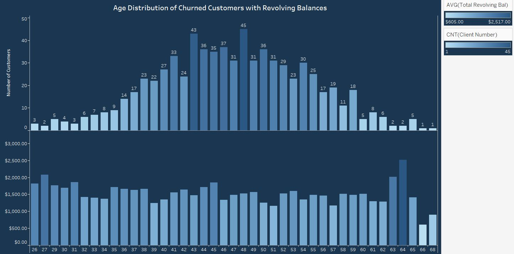
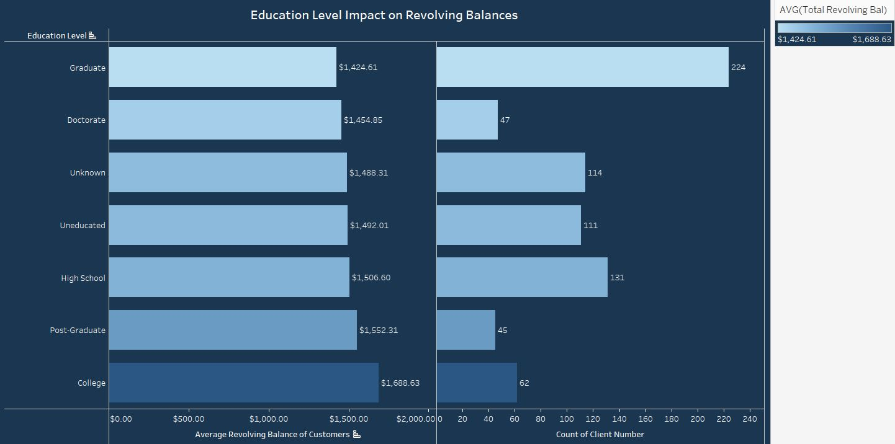
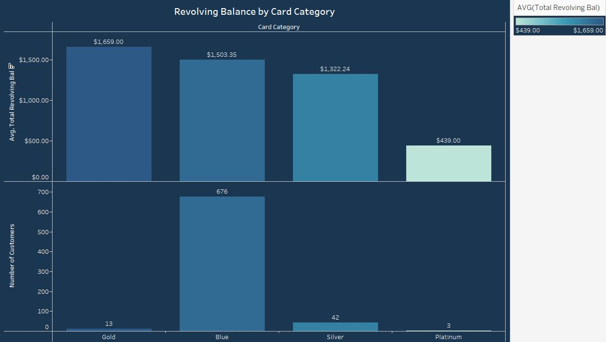

# Sparrow Credit Card Revolving Balances Analysis

## Introduction
Welcome to the Sparrow Credit Card Revolving Balances Analysis project! This project explores credit card revolving balance behavior across different demographics and credit card categories to uncover trends and insights.

## Problem Statement
The objective of this analysis was to:
- Understand revolving balance behavior across various demographics
- Compare balances across different credit card categories
- Identify demographic factors influencing higher balances

## Applied Techniques
This project applied techniques in:
- Descriptive Statistics 📊
- Comparative Analysis 🔍
- Trend Analysis 📈
- Data Visualization 📉
- Segmentation Analysis 🔍
- Financial Analysis 💰
- Business Intelligence (BI) Techniques 📊

## Data Sourcing
This analysis utilized credit card transactions and demographic data, which encompasses:
- Credit card balance data
- Demographic details of cardholders
- Credit card category details

## Data Transformation
The data was processed to ensure accuracy and consistency through the following steps:
- **Data Validation**: Checked for duplicates and missing values in key categories. No issues were found, confirming the dataset's quality.
- **Data Selection**: Selected relevant columns from the original dataset to focus on key variables necessary for analysis.
- **Data Transformation**: Aggregated data by demographic and credit card categories to support detailed analysis.
- **Calculated Fields**: Created calculated fields in Tableau to categorize customers by credit limit and age groups, enhancing the analysis.

## Modelling
Key analyses included:
- **Comparative Analysis**: Compared balances across different demographics and credit card types to identify significant patterns and differences.
- **Trend Analysis**: Analyzed trends in revolving balances over time to understand temporal changes and behavior.
- **Credit Limit Groups**: Created calculated fields in Tableau to categorize customers into credit limit groups for more detailed analysis of revolving balances.

## Analysis & Visualization
Key insights from the analysis:

**Distribution of Revolving Balances Across Age Groups**
- Customers in their late 30s to late 50s show higher average revolving balances, indicating increased financial activity or credit utilization during these life stages.
- Customers in their 60s generally maintain lower revolving balances, with exceptions noted at ages 63 and 64, despite having the lowest count in this age group.

**Impact of Education Level on Revolving Balances of Churned Customers**
- College-educated customers leave the highest revolving balances, while those with graduate degrees leave lower balances.
- Most customers with revolving balances are at the graduate education level, suggesting a correlation between education and credit management behavior.

**Distribution of Revolving Balances Across Card Categories**
- Gold cardholders have the highest average revolving balances but the lowest count of customers.
- Blue cardholders have the highest count of customers with revolving balances and the second-highest average balances.
- Silver and Platinum cardholders have lower counts and revolving balances, with Platinum cardholders leaving nearly three times smaller average balances.

**Distribution of Revolving Balances Across Income Categories**
- Higher income categories generally exhibit higher average revolving balances.
- Customers in the $80,000 - $120,000 income bracket have the highest average revolving balances, indicating a relationship between income levels and revolving balance behavior.

**Relationship Between Credit Limit Groups and Revolving Balances**
- Higher credit limits are associated with lower average revolving balances.
- Customers with credit limits in the lowest category (< $5,000) have the highest revolving balances, suggesting a potential area for credit limit adjustments to manage risk.

### Key Findings

| Metric                                | Value                                  |
|---------------------------------------|----------------------------------------|
| **Highest Average Balance by Demographic** | Customers in their late 30s to late 50s, particularly those in higher income brackets |
| **Top Credit Card Category**          | Gold Card                              |

## Conclusion and Recommendations
Based on the analysis, the following conclusions were drawn:
- Higher average revolving balances are observed among certain age groups and education levels.
- Credit limit and income levels have significant impacts on revolving balances.
- There are notable differences in revolving balances across credit card categories.

**Actionable Recommendations**  
1. **Refine Customer Segmentation and Financial Education**: Enhance financial education programs and refine customer segmentation to address patterns such as higher average revolving balances among specific education levels and age groups.  
   - **Outcome**: Minimized revolving balance losses and optimized balances.
2. **Reduce Marketing Costs through Targeted Campaigns**: Implement targeted marketing campaigns focusing on identified customer clusters such as Blue cardholders in lower income brackets.  
   - **Outcome**: Identified potential annual savings of $50,000 in marketing costs.
3. **Reduce Customer Churn**: Develop strategies to reduce churn by 20%, especially targeting clusters with high revolving balances like Blue and Gold cardholders.  
   - **Outcome**: Potential savings of $100,000 by reducing churn.
4. **Enhance Customer Retention through Trends Analysis**: Use trends analysis to improve retention, focusing on age groups with high revolving balances.  
   - **Outcome**: Increased retention by 15% with an expected $200 decrease in costs.

**Areas for Further Investigation**  
1. **Investigate Correlations Between Credit Limits and Revolving Balances**: Explore why higher credit limit groups have lower average revolving balances and identify key drivers behind these patterns.  
   - **Potential Outcome**: Better understanding of customer behavior and more targeted financial education.
2. **Analyze Discrepancies and Anomalies**: Look into anomalies such as higher balances left by 63 and 64-year-olds, and differences across card categories.  
   - **Potential Outcome**: More precise customer segmentation and personalized financial advice.
3. **Utilize Clusters for Targeted Marketing**: Further segment customers based on purchasing behavior and demographics to enhance marketing effectiveness.  
   - **Potential Outcome**: Improved marketing efficiency and customer engagement.

### Screenshots and Visualizations

For interactive dashboards, check out the [Tableau Dashboard](https://public.tableau.com/views/AnalysisofRevolvingBalanceBehaviourWorksheets/Dashboard?:language=en-GB&:sid=&:redirect=auth&:display_count=n&:origin=viz_share_link) on Tableau Public or alternatively you can download the file [here](tableau_visuals/Revolving_balance_analysis.twbx) directly from my repository.

## Data Access and Processed Datasets
- [Original Data Set](link_to_data_source)
- [`processed_data.csv`](link_to_processed_data): Contains cleaned and aggregated data used in the analysis.

Feel free to explore the provided notebooks and datasets for more details.

---

Happy analyzing! 🤓 If you have any questions or need further details, please feel free to contact me.
