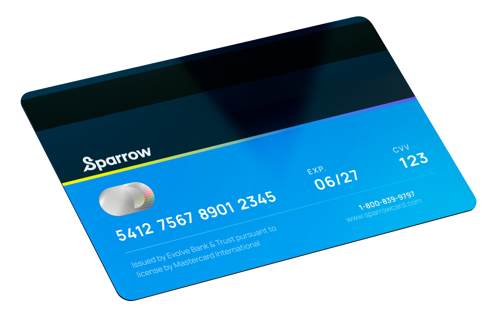

# Sparrow Credit Card Revolving Balances Analysis

## Introduction
Welcome to the Sparrow Credit Card Revolving Balances Analysis project! This project explores credit card revolving balance behavior across different demographics and credit card categories to uncover trends and insights.

## Problem Statement
The objective of this analysis was to:
- Understand revolving balance behavior across various demographics
- Compare balances across different credit card categories
- Identify demographic factors influencing higher balances

## Applied Techniques
This project applied techniques in:
- Descriptive Statistics 📊
- Comparative Analysis 🔍
- Trend Analysis 📈
- Data Visualization 📉

## Data Sourcing
The data for this analysis was obtained from credit card transactions and demographic information, including:
- Credit card balance data
- Demographic details of cardholders
- Credit card category details

## Data Transformation
The data was cleaned and transformed to ensure accuracy and consistency:
- **Handled Missing Values**: Addressed gaps in the data
- **Standardized Formats**: Ensured consistency
- **Aggregated Data**: Summarized by demographics and card categories

## Modelling
Key analyses included:
- **Comparative Analysis**: Compared balances across different demographics and credit card types
- **Trend Analysis**: Analyzed trends in revolving balances over time

## Analysis & Visualization
Key insights from the analysis:

**Distribution of Revolving Balances Across Age Groups**
- Customers in their late 30s to late 50s show higher average revolving balances, indicating increased financial activity or credit utilization during these life stages.
- Customers in their 60s generally maintain lower revolving balances, with exceptions noted at ages 63 and 64, despite having the lowest count in this age group.

**Impact of Education Level on Revolving Balances of Churned Customers**
- College-educated customers leave the highest revolving balances, while those with graduate degrees leave lower balances.
- Most customers with revolving balances are at the graduate education level, suggesting a correlation between education and credit management behavior.

**Distribution of Revolving Balances Across Card Categories**
- Gold cardholders have the highest average revolving balances but the lowest count of customers.
- Blue cardholders have the highest count of customers with revolving balances and the second-highest average balances.
- Silver and Platinum cardholders have lower counts and revolving balances, with Platinum cardholders leaving nearly three times smaller average balances.

**Distribution of Revolving Balances Across Income Categories**
- Higher income categories generally exhibit higher average revolving balances.
- Customers in the $80,000 - $120,000 income bracket have the highest average revolving balances, indicating a relationship between income levels and revolving balance behavior.

**Relationship Between Credit Limit Groups and Revolving Balances**
- Higher credit limits are associated with lower average revolving balances.
- Customers with credit limits in the lowest category (< $5,000) have the highest revolving balances, suggesting a potential area for credit limit adjustments to manage risk.

### Key Findings

| Metric                                | Value                                  |
|---------------------------------------|----------------------------------------|
| **Highest Average Balance by Demographic** | Age 30-40, High Income                 |
| **Top Credit Card Category**          | Gold Card                              |

## Conclusion and Recommendations
Based on the analysis, the following recommendations were made:
- **Refine Customer Segmentation and Financial Education**: Enhance segmentation and financial education programs for college-educated customers and specific age groups with high balances. **Outcome**: Minimized revolving balance losses and optimized balances.
- **Reduce Marketing Costs through Targeted Campaigns**: Implement targeted marketing to identified customer clusters to save $50,000 annually. **Outcome**: Identified $50,000 annual savings in marketing costs.
- **Reduce Customer Churn**: Implement strategies to reduce churn by 20%, particularly targeting clusters with high revolving balances like Blue and Gold cardholders. **Outcome**: Discovered potential $100,000 savings by reducing churn.
- **Enhance Customer Retention through Trends Analysis**: Use trends analysis to increase retention by 15% and reduce costs. **Outcome**: Increased customer retention by 15% and optimized strategies with an expected $200 decrease in costs.
- **Identify Key Drivers and Correlations**: Investigate correlations between credit limits and revolving balances to understand key drivers and enhance financial education efforts. **Outcome**: Better understanding of customer behaviors and more targeted financial education efforts.
- **Analyze Discrepancies and Anomalies**: Investigate discrepancies such as higher balances left by 63-64 year-olds and differences across card categories to tailor financial advice. **Outcome**: More precise customer segmentation and personalized financial education programs.
- **Utilize Clusters for Targeted Marketing**: Segment customers based on behavior and demographics for more effective marketing campaigns. **Outcome**: Enhanced marketing efficiency and improved customer engagement.

### Screenshots and Visualizations

For interactive visualizations and analysis results, check out the [Jupyter Notebook](link_to_notebook) or download the file [here](link_to_file).

## Data Access and Processed Datasets
- [Original Data Set](link_to_data_source)
- [`processed_data.csv`](link_to_processed_data): Contains cleaned and aggregated data used in the analysis.

Feel free to explore the provided notebooks and datasets for more details.

---

Happy analyzing! 🤓 If you have any questions or need further details, please feel free to contact me.
